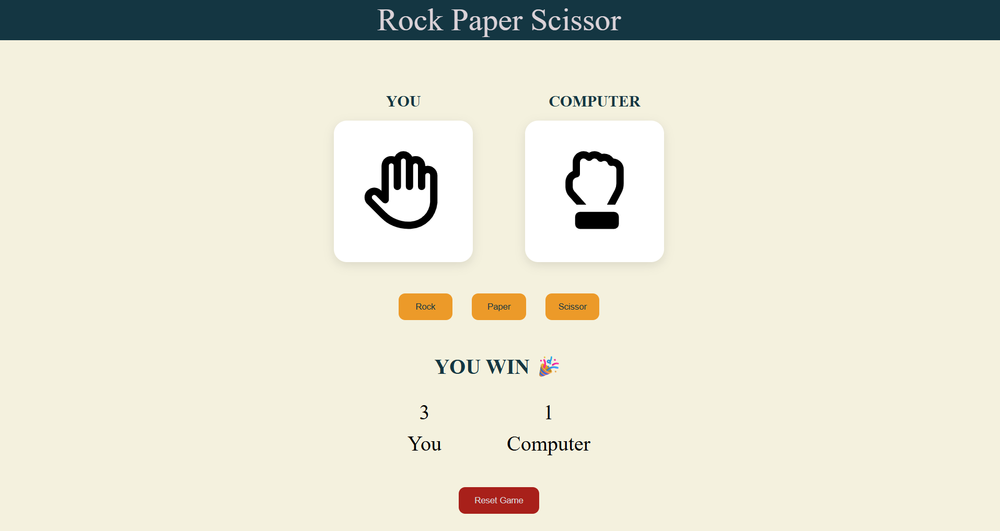

# 🎮 Rock Paper Scissors Game

A modern Rock Paper Scissors game built using **HTML, CSS, and JavaScript**.

## ✨ Features

- 🎨 Clean and responsive UI
- 🤖 Computer opponent with random moves
- 🔄 Fake cycling animation for suspense
- 🔊 Sound effects (tick + reveal sound)
- 🏆 Live score tracking
- 🎯 Winner/Draw detection
- 🔒 Anti-spam click protection
- 🔄 Reset game functionality
- ⚡ Simultaneous reveal for fair gameplay

## 🛠️ Tech Stack

- HTML
- CSS
- JavaScript

## 🚀 How to Run

1. Clone the repository

```bash
git clone https://github.com/Rishabh-09-eng/rock-paper-scissors-game.git
```

2. Open the project folder

3. Run `index.html` in browser

## 📸 Preview



## 📚 What I Learned

While building this project, I practiced:

- DOM Manipulation
- Event Listeners
- `setInterval()` and `setTimeout()`
- JavaScript game logic
- State management
- Debugging and fixing UI/logic bugs

## 🔗 Live Demo

https://rishabh-09-eng.github.io/rock-paper-scissors-game/

---

Made with ❤️ by Rishabh